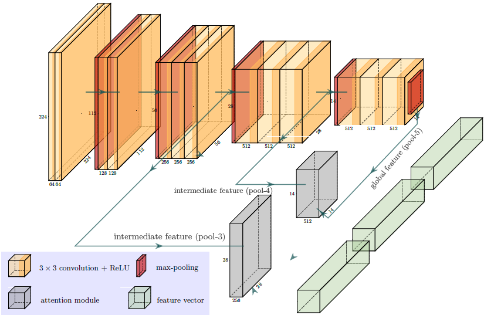
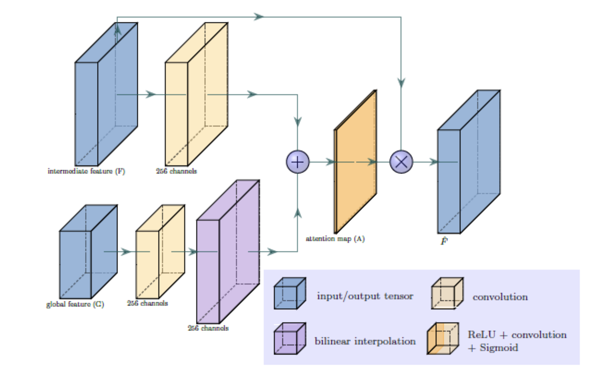

# How Attention Improves a CNN’s performance: A Beginner's Perspective 
Data Science, Computer Vision, Attention Layer, Artificial Intelligence, Machine Learning 

Completed by: Ong Jun Hong, Heng Kim Rui, Aw Chong Kiang, Lum Nian Hua Eunice

## Table of Contents
1. [Introduction](#intro)
2. [What is Attention?](#what)
3. [Structure of a Basic Attention Model](#struc)
4. [Attention Score Function](#score)
5. [Attention Alignment Function](#align)
6. [Types of Attention Mechanism](#type)
7. [Model Architecture](#model)
8. [Experiment](#exp)
9. [Results](#result)
10. [Conclusion](#conclude)
11. [References](#ref)

## [Introduction](#home) 
In recent years, image classification has witnessed remarkable advancements with the advent of deep learning models. Among these models, convolutional neural networks (CNNs) have emerged as powerful tools for extracting hierarchical representations from images. The VGG16_bn model, with its deep architecture and batch normalization, has proven to be a reliable choice for various computer vision tasks, including image classification.

However, despite the remarkable success of CNNs, they often treat all image regions equally and fail to focus on the most discriminative parts of an image. This limitation can hinder their performance, especially when dealing with complex and cluttered scenes. To address this, attention mechanisms have gained significant attention in the deep learning community.

The idea behind attention mechanisms is to enable the network to selectively focus on informative regions of an image while suppressing irrelevant or noisy regions. By incorporating attention layers into the VGG16_bn model, we can enhance its ability to attend to salient features and make more informed decisions during the classification process.

The motivation behind this article is to understand the attention mechanism and explore the effectiveness of attention mechanisms in improving the image classification performance of the VGG16_bn model. By introducing attention layers, we aim to enable the model to dynamically allocate its computational resources to the most relevant image regions, effectively capturing fine-grained details and improving its discriminative power.

## [What is Attention?](#home) 
Attention is a topic widely discussed and studied in both neuroscience and psychology. While there are many definitions of Attention, it can be considered as a resource allocation scheme - means to quickly select and process more important information from massive information using limited resources.

Attention was originally introduced as an extension to recurrent neural networks. With the introduction of the Transformer model, attention became popular and was quickly adopted for a variety of deep learning models across many different domains and tasks such as image processing, video processing, time-series dataset and recommender systems.

## [Structure of a Basic Attention Model](#home) 
[Figure 1](#fig1) shows an overview of attention model. While there are many variations of attention mechanism being employed, the objective of all attention models is to generate the context vector, which is usually a weighted average of all value vectors. This context vector will then be used to compute the prediction output. All attention models will need to have the following functions in order to output the context vector:

| Attention Function | Description |
| -- | -- |
| Score Function | &bull; Score function $score$ use query $q$ and keys matrix $K$ to calculate vector of attention scores $e = [e_1, \ldots, e_{n_f}] \in \mathbb{R}^{n_f}$ where $n_f$ represents the number of features that are extracted from inputs: $$e_l = score(q, k_l)$$ |
| Distribution Function  (Also known as alignment function) | &bull; Calculate the attention weights by redistributing the attention scores (which can generally have a wide range outside of [0, 1]) such that the attention weight is aligned to the correct value vector.  &bull; The vector of attention weights $a = [a_1, \ldots, a_{n_f}] \in \mathbb{R}^{n_f}$ is used to produce the context vector $c \in \mathbb{R}^{d_v}$ by calculating a weighted average of the columns of the values matrix $V$: $$c = \sum_{l=1}^{n_f} a_l * v_l$$ |

    

Figure 1: Overview of Attention Model ([[3]](#3) Niu, Z. (2021) p.g. 3)

## [Attention Score Function](#home) 
As mentioned earlier, query symbolizes a request for information. Attention score represents how important the information contained in the key vector is according to the query. List of different types of score functions are shown below:

| Score Function | Description |
| -- | -- |
| Additive | &bull; Element wise summation of Weighted matrices of query and key followed by activation function  &bull; Britz et al. [[2]](#2) found that parameterized additive attention mechanisms outperformed multiplicative mechanisms slightly but consistently. $$w^T * act(W_1 * q + W_2 * k_l + b)$$ $$\text{where } w \in \mathbb{R}^{d_w}, W_1 \in \mathbb{R}^{d_w \times d_q}, W_2 \in \mathbb{R}^{d_w \times d_k}, b \in \mathbb{R}^{d_w}$$ |
| Concat | &bull; Instead of having 2 weights matrices for q and k, q and k are concatenated; and a single weight is applied to it. $$w^T * act(W[q; k] + b)$$ $$\text{where } w \in \mathbb{R}^{d_w}, W \in \mathbb{R}^{d_w \times d_q+d_k}, b \in \mathbb{R}^{d_w}$$ |
| Multiplicative  (Dot-Product) | &bull; Computationally inexpensive due to highly optimized vector operations.  &bull; May produce non-optimal results when dimension dk  is too large i.e. softmax of these large numbers will result in gradients becoming too small, causing trouble of model converging. $$q^T \cdot k_l$$ |
| Scaled Multiplicative | &bull; Address the issue dimension $d_k$ being too large. $$\frac{{q^T \cdot k_l}}{{\sqrt{d_k}}}$$ |
| General | &bull; Extend multiplicative function by introducing weights matrix W, which can be applied to keys and queries with different representation. $$k^T_l * W * q$$ $$\text{where } W \in \mathbb{R}^{d_k \times d_q}$$ |
| Biased General | &bull; Further extension of general function by including a bias weight vector. $$k^T_l * W * q + b$$ $$\text{where } W \in \mathbb{R}^{d_k \times d_q}, b \in \mathbb{R}^{d_k}$$ |
| Activated General | &bull; Includes both bias and activation function, $act$. $$act(k^T_l * W * q + b)$$ $$\text{where } W \in \mathbb{R}^{d_k \times d_q}, b \in \mathbb{R}^{d_k}$$ |
| Similarity | &bull; Weightages are calculated based on how ‘similar’ are the key and query vectors such as using Euclidean ($L2-norm$) distance and cosine similarity. |

Note that:
- $k$ (vector; an element of $K$ matrix), $v$, $b$, $W$, $W_1$ and $W_2$ are learnable parameters. 
- $d_k$ is the dimension of key matrix, $K$.
- $act$ is the nonlinear activation function such as tanh and ReLU.

There is no specific score function that can be used across domains. Choice of score function for a particular task is often based on empirical experiments. However, if efficiency is vital, multiplicative or scaled multiplicative core functions are typically the best choice.

## [Attention Alignment Function](#home) 
The goal of attention alignment is to generate the context vector, which will be used by the output model to generate prediction. Following steps are taken:
1. Using the attention scores as input, it calculates the attention weights for each corresponding value vector in $V$ matrix.
2. These attention weights can then be used to create the context vector $c$ by, for example, taking the weighted average of the value vectors. Examples of alignment functions are as follows:

| Alignment Function | Description |
| -- | -- |
| Softmax | &bull; Most popular alignment method to calculate attention weights.  &bull; Often referred to as soft alignment in computer vision or global alignment for sequence data.  &bull; Ensures that every part of input receives at least some amount of attention.  &bull; Introduce probabilistic interpretation to input vectors, allowing easy analysis of which parts of inputs are important to the output predictions. |
| Sparsemax | &bull; Assign exactly zero probability to some of its output variables if sparse probability distribution is desired. |
| Sigmoid | &bull; Scaled energy scores between 0 and 1 like softmax.  &bull; However, sum of all attention weights will not be 1 for multiple features. |
| Hard Alignment | &bull; Forces attention model to focus on exactly one feature vector. &bull; Applies softmax on the attention scores but uses the outputs as probabilities to draw the choice of the one value vector instead of weighted averages of all value vectors. &bull; While it is more efficient at inference compared to soft alignment, gradients are not differentiable.  &bull; As such, training cannot be done via regular backpropagation. Instead, sampling or reinforcement learning are required to calculate the gradient at the hard attention layer. |
| Local Alignment | &bull; Applies softmax distribution on a subset of inputs rather than the entire inputs. &bull; First predicts a single aligned position $p_t$ for the current target word. &bull; Then calculate the context vector $c$ based on window centered around the source position $p_t$ i.e. $[-D+p_t, D+p_t]$.  &bull; The advantage is that the gradient is differentiable despite taking only a subset of inputs to perform softmax each time. |
| Reinforced Alignment | &bull; Uses reinforcement learning agent, similar to hard alignment, to choose a subset of feature vectors. &bull; However, the attention calculation based on these chosen feature vectors is the same as regular soft alignment i.e. allows back propagation. |

## [Types of Attention Mechanism](#home) 
Brauwers et al. [[4]](#4) created a taxonomy to classify the different types of attention mechanisms into 3 main categories namely: feature-related, query-related or general (i.e. not feature or query related).

1. General
- Consists of attention mechanisms (i.e. attention scoring, attention alignment and attention dimensionality) that can be applied in any type of attention model.
- Different attention scoring and alignment have been covered in Section 4: [Attention Score Function](#score) and Section 5: [Attention Alignment Function](#end).
- Attention dimensionality is choosing between a single attention score and weight for the entire feature vector or calculating weights for every single element (entire dimension)  of that specified feature vector.
   
3. Feature-Related

| Feature Type | Description |
| -- | -- |
| Number of inputs to be attended | &bull; E.g. Co-Attention to jointly attend to both an image and a question (i.e. 2 inputs).  &bull; Rotary attention incorporates 3 input phrases: left, right and target phrase. |
| Different levels of details | &bull; E.g. attention-via-attention predict sentence translation character-by-character while also incorporating information from a word-level attention module (i.e. 2 levels).  &bull; Hierarchical attention starts at lowest level and then creates representation of next level using attention until highest level is reached. E.g. words -> sentences -> documents. |
| Single or multiple representation of inputs | &bull; E.g. multiple representations of the same book can be textual, syntactic, semantic, visual, etc.  &bull; Multi-representational attention takes weighted average of multiple representation, where the weights are determined by attention. |
   
3. Query-Related

| Query Type | Description |
| -- | -- |
| Basic Query | &bull;  Straightforward to define based on data and model  &bull; E.g. patient characteristics can be a query for medical image classification. |
| Specialized Query | &bull; E.g. rotary attention uses context vector from another attention module as query.  &bull; On the hand, interactive co-attention uses an averaged keys vector based on another input as query. |
| Self-attention (Intra-attention) | &bull; Often used in feature model to create improved represenations of the feature vectors by:  &nbsp;&nbsp;&nbsp;&nbsp;&nbsp;- Setting feature vectors to be equal to the acquired self-attention context vectors.  &nbsp;&nbsp;&nbsp;&nbsp;&nbsp;- Adding the context vectors to the previous feature vectors with an additional normalization layer.  &bull; Query is ignored/removed and only the key is used to calculate the attention score.  &bull; Using Concat scoring function, the equation would be: $$score(k_l) = w^T * act(W * k_l + b)$$ |
| Multiple or single query per prediction | &bull; Multi-head attention processes multiple attention modules in parallel.  &bull; Multi-hop attention to refine the context vectors iteratively through the multiple attention modules.  &bull; Capsule-based attention which assigns a separate attention module to each of the prediction classes. |

## [Model Architecture](#home) 
We leverage on the attention-based method for melanoma recognition proposed by Yan, Y. [[1]](#1) for image classification of cats and dogs. The overall network architecture is shown in [Figure 2](#fig2).

 

Figure 2: Overall Network Architecture ([[1]](#1) Yan, Y., J., & Hamarneh, G. (2019) p.g. 3)

Breakdown of the architecture is as follows:

- VGG-16 (yellow and red blocks), without the dense layers, serves as the backbone network.
- Pool-3 and pool-4 are intermediate feature maps found in the VGG-16 layers, while pool-5 is the final output of VGG-16 convolutional layers (i.e. without the dense players). 
- An attention module (gray block) is applied to pool-3 and pool-5 while the other is applied to pool 4 (closer to the output) and pool 5.
- Global average pooling is applied to outputs of the 2 attention module and pool-5 to generate 3 feature vectors (green blocks).
- These feature vectors are then concatenated together to form the final feature vector, which serves as the input to the classification layer.
- Classification layer (not shown above) is a fully connected dense layer to perform the classification.
- Whole network is trained end-to-end.

 

## [References](#home) 
[1]  Yan, Y., Kawahara, J., & Hamarneh, G. (2019). Melanoma Recognition via Visual Attention. In Lecture Notes in Computer Science  &nbsp;&nbsp;&nbsp;&nbsp;&nbsp; (pp. 793–804). Springer Science+Business Media. https://doi.org/10.1007/978-3-030-20351-1_62
  [2]  Britz, D., Goldie, A., Luong, M., & Le, Q. V. (2017). Massive Exploration of Neural Machine Translation Architectures.  &nbsp;&nbsp;&nbsp;&nbsp;&nbsp;https://doi.org/10.18653/v1/d17-1151
  [3]  Niu, Z., Zhong, G., & Yu, H. (2021). A review on the attention mechanism of deep learning. Neurocomputing, 452, 48–62.  &nbsp;&nbsp;&nbsp;&nbsp;&nbsp;https://doi.org/10.1016/j.neucom.2021.03.091
  [4]  Brauwers, G., & Frasincar, F. (2023). A General Survey on Attention Mechanisms in Deep Learning. IEEE Transactions on Knowledge and  &nbsp;&nbsp;&nbsp;&nbsp;&nbsp;Data Engineering, 35(4), 3279–3298. https://doi.org/10.1109/tkde.2021.3126456
