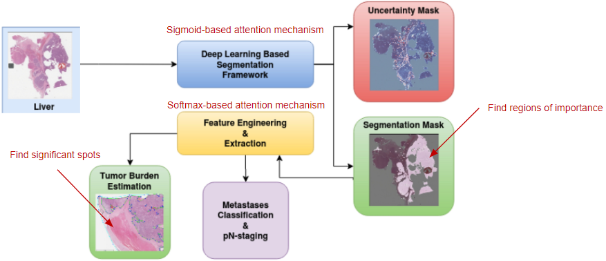

# How Attention Improves a CNN’s performance: A Beginner's Perspective <a name="home"></a>
**Index Terms**: Data Science, Computer Vision, Attention Layer, Artificial Intelligence, Machine Learning 

Completed by: Ong Jun Hong, Heng Kim Rui, Aw Chong Kiang, Lum Nian Hua Eunice

## Table of Contents
1. [Introduction](#intro)
2. [What is Attention?](#what)
3. [Structure of a Basic Attention Model](#struc)
4. [Attention Score Function](#score)
5. [Attention Alignment Function](#align)
6. [Types of Attention Mechanism](#type)
7. [Model Architecture](#model)
8. [Experiment](#exp)
9. [Results](#result)
10. [Comparison with GradCam](#compare)
11. [Future Work](#future)
12. [Conclusion](#conclude)
13. [References](#ref)

## [Introduction](#home) <a name="intro"></a>
In recent years, image classification has witnessed remarkable advancements with the advent of deep learning models. Among these models, convolutional neural networks (CNNs) have emerged as powerful tools for extracting hierarchical representations from images. The VGG16_bn model, with its deep architecture and batch normalization, has proven to be a reliable choice for various computer vision tasks, including image classification.

However, despite the remarkable success of CNNs, they often treat all image regions equally and fail to focus on the most discriminative parts of an image. This limitation can hinder their performance, especially when dealing with complex and cluttered scenes. To address this, attention mechanisms have gained significant attention in the deep learning community.

The idea behind attention mechanisms is to enable the network to selectively focus on informative regions of an image while suppressing irrelevant or noisy regions. By incorporating attention layers into the VGG16_bn model, we can enhance its ability to attend to salient features and make more informed decisions during the classification process.

The motivation behind this article is to understand the attention mechanism and explore the effectiveness of attention mechanisms in improving the image classification performance of the VGG16_bn model. By introducing attention layers, we aim to enable the model to dynamically allocate its computational resources to the most relevant image regions, effectively capturing fine-grained details and improving its discriminative power.

## [What is Attention?](#home) <a name="what"></a>
Attention is a topic widely discussed and studied in both neuroscience and psychology. While there are many definitions of Attention, it can be considered as a resource allocation scheme - means to quickly select and process more important information from massive information using limited resources.

Attention was originally introduced as an extension to recurrent neural networks. With the introduction of the Transformer model, attention became popular and was quickly adopted for a variety of deep learning models across many different domains and tasks such as image processing, video processing, time-series dataset and recommender systems.

In the context of image processing, attention tells the model to perform the following:
- Focus on local regions within the same object e.g. face, eyes, nose, etc.
- Differentiate between different objects e.g. dog versus wolf.
- Differentiate between the object and the background e.g. wolf in snowy background.

## [Structure of a Basic Attention Model](#home) <a name="struc"></a>
[Figure 1](#fig1) shows an overview of attention model. While there are many variations of attention mechanism being employed, the objective of all attention models is to generate the context vector, which is usually a weighted average of all value vectors. This context vector will then be used to compute the prediction output. All attention models will need to have the following functions in order to output the context vector:

| Attention Function | Description |
| -- | -- |
| Score Function | &bull; Score function $score$ use query $q$ and keys matrix $K$ to calculate vector of attention scores $e = [e_1, \ldots, e_{n_f}] \in \mathbb{R}^{n_f}$ where $n_f$ represents the number of features that are extracted from inputs: $$e_l = score(q, k_l)$$ |
| Distribution Function <br>(Also known as alignment function) | &bull; Calculate the attention weights by redistributing the attention scores (which can generally have a wide range outside of [0, 1]) such that the attention weight is aligned to the correct value vector. <br>&bull; The vector of attention weights $a = [a_1, \ldots, a_{n_f}] \in \mathbb{R}^{n_f}$ is used to produce the context vector $c \in \mathbb{R}^{d_v}$ via $\phi(a_i, v_i)$ function, which is usually the weighted average of the columns of the values matrix $V$: $$c = \sum_{l=1}^{n_f} a_l * v_l$$ |

   <a name="fig1"></a> 

Figure 1: Overview of Attention Model ([[3]](#3) Niu, Z. (2021) p.g. 3)

## [Attention Score Function](#home) <a name="score"></a>
As mentioned earlier, query symbolizes a request for information. Attention score represents how important the information contained in the key vector is according to the query. List of different types of score functions are shown below:

| Score Function | Description |
| -- | -- |
| Additive | &bull; Element wise summation of Weighted matrices of query and key followed by activation function <br>&bull; Britz et al. [[2]](#2) found that parameterized additive attention mechanisms slightly but consistently outperformed multiplicative mechanisms. $$w^T * act(W_1 * q + W_2 * k_l + b)$$ $$\text{where } w \in \mathbb{R}^{d_w}, W_1 \in \mathbb{R}^{d_w \times d_q}, W_2 \in \mathbb{R}^{d_w \times d_k}, b \in \mathbb{R}^{d_w}$$ |
| Concat | &bull; Instead of having 2 weights matrices for q and k, q and k are concatenated; and a single weight is applied to it. $$w^T * act(W[q; k] + b)$$ $$\text{where } w \in \mathbb{R}^{d_w}, W \in \mathbb{R}^{d_w \times d_q+d_k}, b \in \mathbb{R}^{d_w}$$ |
| Multiplicative <br>(Dot-Product) | &bull; Computationally inexpensive due to highly optimized vector operations. <br>&bull; May produce non-optimal results when dimension dk  is too large i.e. softmax of these large numbers will result in gradients becoming too small, causing trouble of model converging. $$q^T \cdot k_l$$ |
| Scaled Multiplicative | &bull; Address the issue dimension $d_k$ being too large. $$\frac{{q^T \cdot k_l}}{{\sqrt{d_k}}}$$ |
| General | &bull; Extend multiplicative function by introducing weights matrix W, which can be applied to keys and queries with different representation. $$k^T_l * W * q$$ $$\text{where } W \in \mathbb{R}^{d_k \times d_q}$$ |
| Biased General | &bull; Further extension of general function by including a bias weight vector. $$k^T_l * W * q + b$$ $$\text{where } W \in \mathbb{R}^{d_k \times d_q}, b \in \mathbb{R}^{d_k}$$ |
| Activated General | &bull; Includes both bias and activation function, $act$. $$act(k^T_l * W * q + b)$$ $$\text{where } W \in \mathbb{R}^{d_k \times d_q}, b \in \mathbb{R}^{d_k}$$ |
| Similarity | &bull; Weightages are calculated based on how ‘similar’ are the key and query vectors such as using Euclidean ($L2-norm$) distance and cosine similarity. |

Note that:
- $k$ (vector; an element of $K$ matrix), $v$, $b$, $W$, $W_1$ and $W_2$ are learnable parameters. 
- $d_k$ is the dimension of key matrix, $K$.
- $act$ is the nonlinear activation function such as tanh and ReLU.

There is no specific score function that can be used across domains. Choice of score function for a particular task is often based on empirical experiments. However, if efficiency is vital, multiplicative or scaled multiplicative core functions are typically the best choice.

## [Attention Alignment Function](#home) <a name="align"></a>
The goal of attention alignment is to generate the context vector, which will be used by the output model to generate prediction. Following steps are taken:
1. Using the attention scores as input, it calculates the attention weights for each corresponding value vector in $V$ matrix.
2. These attention weights can then be used to create the context vector $c$ by, for example, taking the weighted average of the value vectors.

Examples of alignment functions are as follows:

| Alignment Function | Description |
| -- | -- |
| Softmax | &bull; Most popular alignment method to calculate attention weights. <br>&bull; Often referred to as soft alignment in computer vision or global alignment for sequence data. <br>&bull; Ensures that every part of input receives at least some amount of attention. <br>&bull; Introduce probabilistic interpretation to input vectors, allowing easy analysis of which parts of inputs are important to the output predictions. |
| Sparsemax | &bull; Assign exactly zero probability to some of its output variables if sparse probability distribution is desired. |
| Sigmoid | &bull; Scaled energy scores between 0 and 1 like softmax. <br>&bull; However, sum of all attention weights will not be 1 for multiple features. |
| Hard Alignment | &bull; Forces attention model to focus on exactly one feature vector.<br>&bull; Applies softmax on the attention scores but uses the outputs as probabilities to draw the choice of the one value vector instead of weighted averages of all value vectors.<br>&bull; While it is more efficient at inference compared to soft alignment, gradients are not differentiable. <br>&bull; As such, training cannot be done via regular backpropagation. Instead, sampling or reinforcement learning are required to calculate the gradient at the hard attention layer. |
| Local Alignment | &bull; Applies softmax distribution on a subset of inputs rather than the entire inputs.<br>&bull; First predicts a single aligned position $p_t$ for the current target word.<br>&bull; Then calculate the context vector $c$ based on window centered around the source position $p_t$ i.e. $[-D+p_t, D+p_t]$. <br>&bull; The advantage is that the gradient is differentiable despite taking only a subset of inputs to perform softmax each time. |
| Reinforced Alignment | &bull; Uses reinforcement learning agent, similar to hard alignment, to choose a subset of feature vectors.<br>&bull; However, the attention calculation based on these chosen feature vectors is the same as regular soft alignment i.e. allows back propagation. |

## [Types of Attention Mechanism](#home) <a name="type"></a>
Brauwers et al. [[4]](#4) created a taxonomy to classify the different types of attention mechanisms into 3 main categories namely: feature-related, query-related or general (i.e. not feature or query related).

1. General
- Consists of attention mechanisms (i.e. attention scoring, attention alignment and attention dimensionality) that can be applied in any type of attention model.
- Different attention scoring and alignment have been covered in Section 4: [Attention Score Function](#score) and Section 5: [Attention Alignment Function](#end).
- Attention dimensionality is choosing between a single attention score and weight for the entire feature vector or calculating weights for every single element (entire dimension)  of that specified feature vector.
   
3. Feature-Related

| Feature Type | Description |
| -- | -- |
| Number of inputs to be attended | &bull; E.g. Co-Attention to jointly attend to both an image and a question (i.e. 2 inputs). <br>&bull; Rotary attention incorporates 3 input phrases: left, right and target phrase. |
| Different levels of details | &bull; E.g. attention-via-attention predict sentence translation character-by-character while also incorporating information from a word-level attention module (i.e. 2 levels). <br>&bull; Hierarchical attention starts at lowest level and then creates representation of next level using attention until highest level is reached. E.g. words -> sentences -> documents. |
| Single or multiple representation of inputs | &bull; E.g. multiple representations of the same book can be textual, syntactic, semantic, visual, etc. <br>&bull; Multi-representational attention takes weighted average of multiple representation, where the weights are determined by attention. |
   
3. Query-Related

| Query Type | Description |
| -- | -- |
| Basic Query | &bull;  Straightforward to define based on data and model <br>&bull; E.g. patient characteristics can be a query for medical image classification. |
| Specialized Query | &bull; E.g. rotary attention uses context vector from another attention module as query. <br>&bull; On the hand, interactive co-attention uses an averaged keys vector based on another input as query. |
| Self-attention (Intra-attention) | &bull; Often used in feature model to create improved represenations of the feature vectors by: <br>&nbsp;&nbsp;&nbsp;&nbsp;&nbsp;- Setting feature vectors to be equal to the acquired self-attention context vectors. <br>&nbsp;&nbsp;&nbsp;&nbsp;&nbsp;- Adding the context vectors to the previous feature vectors with an additional normalization layer. <br>&bull; Query is ignored/removed and only the key is used to calculate the attention score. <br>&bull; Using Concat scoring function, the equation would be: $$score(k_l) = w^T * act(W * k_l + b)$$ |
| Multiple or single query | &bull; Multi-head attention processes multiple attention modules in parallel. <br>&bull; Multi-hop attention to refine the context vectors iteratively through the multiple attention modules. <br>&bull; Capsule-based attention which assigns a separate attention module to each of the prediction classes. |

## [Model Architecture](#home) <a name="model"></a>
We leverage on the attention-based method for melanoma recognition proposed by Yan, Y. [[1]](#1) for image classification of cats and dogs. The overall network architecture is shown in [Figure 2](#fig2).

 <a name="fig2"></a>

Figure 2: Overall Network Architecture ([[1]](#1) Yan, Y., J., & Hamarneh, G. (2019) p.g. 3)

Breakdown of the architecture is as follows:

- VGG-16 (yellow and red blocks), without the dense layers, serves as the backbone network.
- Pool-3 and pool-4 are intermediate feature maps found in the VGG-16 layers, while pool-5 is the final output of VGG-16 convolutional layers (i.e. without the dense players). 
- An attention module (gray block) is applied to pool-3 and pool-5 while the other is applied to pool 4 (closer to the output) and pool 5.
- Global average pooling is applied to outputs of the 2 attention module and pool-5 to generate 3 feature vectors (green blocks).
- These feature vectors are then concatenated together to form the final feature vector, which serves as the input to the classification layer.
- Classification layer (not shown above) is a fully connected dense layer to perform the classification.
- Whole network is trained end-to-end.

Code for AttnVGG16 class is as follows:
``` python
class AttnVGG(nn.Module):
    def __init__(self, num_classes, normalize_attn=False, dropout=None):
        super(AttnVGG, self).__init__()

        # VGG16 CNN Blocks
        net = models.vgg16_bn(weights=VGG16_BN_Weights.DEFAULT)
        self.conv_block1 = nn.Sequential(*list(net.features.children())[0:6]) # nn.Sequential constructor expects each layer to be passed as a separate argument, rather than as a list or tuple. * used to unpack liste of layers
        self.conv_block2 = nn.Sequential(*list(net.features.children())[7:13])
        self.conv_block3 = nn.Sequential(*list(net.features.children())[14:23])
        self.conv_block4 = nn.Sequential(*list(net.features.children())[24:33])
        self.conv_block5 = nn.Sequential(*list(net.features.children())[34:43])
        self.pool = nn.AvgPool2d(7, stride=1) # kernel size of 7x7 and a stride of 1

        # Attention Block
        # initialize the attention blocks defined above
        self.attn1 = AttentionBlock(256, 512, 256, 4, normalize_attn=normalize_attn)
        self.attn2 = AttentionBlock(512, 512, 256, 2, normalize_attn=normalize_attn)

        # Dropout Layer
        self.dpt = None
        if dropout is not None:
            self.dpt = nn.Dropout(dropout)

        # Output layer    
        self.cls = nn.Linear(in_features=512+512+256, out_features=num_classes, bias=True)
       
        self.reset_parameters(self.attn1)
        self.reset_parameters(self.attn2)
        self.reset_parameters(self.cls)


    def reset_parameters(self, module): # Ensure the weights and biases are properly initialized before training the model
        for m in module.modules():
            if isinstance(m, nn.Conv2d):
                nn.init.kaiming_normal_(m.weight, mode='fan_in', nonlinearity='relu')
                if m.bias is not None:
                    nn.init.constant_(m.bias, 0.)
            elif isinstance(m, nn.BatchNorm2d):
                nn.init.constant_(m.weight, 1.)
                nn.init.constant_(m.bias, 0.)
            elif isinstance(m, nn.Linear):
                nn.init.normal_(m.weight, 0., 0.01)
                nn.init.constant_(m.bias, 0.)

    def forward(self, x):
        # CNN Block
        block1 = self.conv_block1(x)           # /1
        pool1 = nn.MaxPool2d(2, 2)(block1)     # /2
        block2 = self.conv_block2(pool1)       # /2
        pool2 = nn.MaxPool2d(2, 2)(block2)     # /4
        block3 = self.conv_block3(pool2)       # /4
        pool3 = nn.MaxPool2d(2, 2)(block3)     # /8
        block4 = self.conv_block4(pool3)       # /8
        pool4 = nn.MaxPool2d(2, 2)(block4)     # /16
        block5 = self.conv_block5(pool4)       # /16
        pool5 = nn.MaxPool2d(2, 2)(block5)     # /32 #Global feature vector is the resultant vector after MaxPool2d of block 5
        N, __, __, __ = pool5.size()           # N represents the batch size
        
        # Attention Block
        a1, g1 = self.attn1(pool3, pool5)      # Attention map 1 - pool3 Intermediate feature map/ pool5 Global feature map
        a2, g2 = self.attn2(pool4, pool5)      # Attention map 2 - pool4 Intermediate feature map/ pool5 Global feature map
        g = self.pool(pool5).view(N,-1)       # Connection between VGG16 CNN and Attention block - Global feature map reshapes the tensor to have N rows and 512 columns
        
        # Flattening
        g_hat = torch.cat((g,g1,g2), dim=1)    # Flattening - shape (N, C)

        if self.dpt is not None:               # Dropout layer
            g_hat = self.dpt(g_hat)
        out = self.cls(g_hat)                  # Linear layer

        return out, a1, a2
    
    def count_trainable_params(self):
        return sum(p.numel() for p in self.parameters() if p.requires_grad)
```

 <a name="fig3"></a>

Figure 3: Inner Workings of Attention Module ([[1]](#1) Yan, Y., J., & Hamarneh, G. (2019) p.g. 4)

The inner workings of the attention modules (as shown in [Figure 3](#fig3)) are as follows:

- Being the last stage feature, output of pool-5 contains the most compressed and abstracted information over the entire image; and therefore serves a form of “global guidance” i.e. global feature $\mathcal{G}$.
- Upsampling of $\mathcal{G}$ via bilinear interpolation to ensure its spatial size is aligned with the intermediate features $\mathcal{F}$.
- $\mathcal{F}$ and upsampled $\mathcal{G}$ are fed through the attention module to generate a one-channel response $\mathcal{R}$: $$\mathcal{R} = W \circledast ReLU(W_f \circledast \mathcal{F} + up(W_g \circledast \mathcal{G}))$$ $$\text{where } \circledast \text{represents a convolutional operation; } W_f, W_g \text{ and } W \text{ are convolutional kernels; and } up(.) \text{ is a bilinear interpolation.}$$
- $\mathcal{R}$ is then transformed via $Sigmoid$ function to generate the attention map $\mathcal{A}$: $$\mathcal{A} = Sigmoid(\mathcal{R})$$
- Attention-version of pool-3 and pool-4 features are generated via ‘pixel-wise’ multiplication of the intermediate features with the attention map: $$\hat{f_i} = a_i \cdot f_i$$ $$\text{where scalar element } a_i \in \mathcal{A} \text{ represents the degree of attention to the corresponding spatial feature vector in } \mathcal{F} \text{;}$$ $$\text{and each feature vector } f_i \text{ is multiplied by the attention element } a_i \text{ to get the attention-version } \hat{f_i}$$

Codes for attention block class is as follows:
``` python
class AttentionBlock(nn.Module):
    def __init__(self, in_features_l, in_features_g, attn_features, up_factor, normalize_attn=True): #256, 512, 256, 4
        super(AttentionBlock, self).__init__()
        self.up_factor = up_factor
        self.normalize_attn = normalize_attn
        self.W_l = nn.Conv2d(in_channels=in_features_l, out_channels=attn_features, kernel_size=1, padding=0, bias=False) 
        self.W_g = nn.Conv2d(in_channels=in_features_g, out_channels=attn_features, kernel_size=1, padding=0, bias=False)  
        self.phi = nn.Conv2d(in_channels=attn_features, out_channels=1, kernel_size=1, padding=0, bias=True)
        
    def forward(self, l, g):
        N, C, H, W = l.size()
        l_ = self.W_l(l)
        g_ = self.W_g(g)
        if self.up_factor > 1:
            g_ = nn.functional.interpolate(g_, scale_factor=self.up_factor, mode='bilinear', align_corners=False)
        c = self.phi(nn.functional.relu(l_ + g_)) # batch_sizex1xHxW
        
        # compute attn map
        if self.normalize_attn:
            a = nn.functional.softmax(c.view(N,1,-1), dim=2).view(N,1,H,W)
        else:
            a = torch.sigmoid(c) # if normalize_attn == False
        # re-weight the local feature
        f = torch.mul(a.expand_as(l), l) # batch_sizexCxHxW
        if self.normalize_attn:
            output = f.view(N,C,-1).sum(dim=2) # weighted sum
        else:
            output = nn.functional.adaptive_avg_pool2d(f, (1,1)).view(N,C) # global average pooling
        return a, output
```

## [Experiments](#home) <a name="exp"></a>
We ran our experiments on 10000 images belonging to cats and dogs. No processing of images is required as the images are of similar size. No regularization via regions of interest are carried out. We didn't add any dropout. Hence we used just the binary cross-entropy loss instead of focal loss in the original literature without regularization terms.

PyTorch is used to implement the model. Back-bone network is initialized with VGG-16 pre-trained on ImageNet, and the attention modules are initialized with He’s initialization. Due to time constraints, the whole network is only trained end-to-end for up to 20 epochs using Adam optimizer. Working codes can be found in our jupyter notebook: [Image Classification with Attention.ipynb](./Notebook/Image_Classification_with_Attention.ipynb).

In terms of quantitative evaluation, the performance of the models with attention is measured using the average precision (AP) and the area under the ROC curve (AUC). These metrics were the official evaluation metrics used in the ISIC 2016 and 2017 challenges, respectively. The results of the experiments are then compared with VGG-16 network without attention mechanisms to identify whether attention does improve our image classification of dogs and cats. The original literature uses Sigmoid normalization for the attention mechanism. We tried out Softmax normalization as an alternative.

## [Results](#home) <a name="result"></a>
We begin our analysis with the AttnVGG16 (i.e. VGG16 model with attention mechanism) using different types of normalization, specifically sigmoid and softmax normalization. We show the differences in attention level from pool 3 and pool 4. In addition, we are interested to determine how attention maps improve as number of epochs increase from 1, 5 to 20 epochs. We attempt to explain our difference in findings for AttnVGG16 model using sigmoid versus softmax normalization. Lastly, we presented the Loss and accuracy graph for 15 epochs; and attempt to correlate findings with the architecture differences between the original VGG16 model and our AttnVGG16 model.

**Attention layer from Pool 3 and Pool 4 for sigmoid**


**Attention layer from Pool 3 and Pool 4 for softmax**


From the above figures, we noticed that sigmoid normalization appears to be able to identify dogs better than cats images but not for softmax normalization - It appears that the attention mask is only fixated on distinct features (i.e. small spots) specifically the dog nose.

**Attention layer from Pool 3 for sigmoid and softmax at 1, 5 and 20 epochs**


**Attention layer from Pool 4 for sigmoid and softmax at 1, 5 and 20 epochs**


As number of epochs increases, we noted that Pool 3 attention focuses on dog features while Pool 4 attention focuses on non-dog features. No distinct imporovements can be observed for softmax normalization as epochs increases.

In summary, we noted:
- Attention plots showed that the model (using sigmoid) has learnt to assign weights to different spatial locations in the feature maps. These weights determine the importance of each location during the forward pass, allowing the model to dynamically focus on the most relevant regions. Model is suitable for dataset that contains complex or cluttered backgrounds, occlusions, or small objects.
- On the other hand, model (using softmax) to choose a single region with the highest importance, focusing on only one subject. Other cats and dogs subjects which are of relevance are ignored.

**Possible Explanation**

We list plausible causes for the observations observed for both sigmoid and softmax normalization.


| Normalization | Explanations |
| -- | -- |
| Sigmoid | &bull; Allows for a more fine-grained control over the importance assigned to different image regions. <br>&bull; Outputs values between 0 and 1, which can be interpreted as the relevance or importance of each region. <br>&bull; This means that even regions with relatively lower scores can still contribute to the overall attention. <br>&bull; The model can attend to multiple regions simultaneously and assign varying degrees of importance to them. <br>&bull; This flexibility allows for the identification and emphasis of clusters of image regions that are collectively important. |
| Softmax | &bull; Normalize the scores and emphasize only a few pixels with the highest values. <br>&bull; Softmax outputs a probability distribution that forces the model to choose a single region with the highest importance, effectively suppressing the relevance of other regions. <br>&bull; This can result in a more focused attention on individual pixels or small regions, potentially overlooking important details within clusters or larger image regions. |

**AttnVGG16 versus VGG16**

Main differences between our AttnVGG16 and VGG16 lies in the full connected layer - We replace the full connected layer in the original VGG16 model with 2 attention module from pool 3 and pool 4 as shown below:


Accuracy, recall, precision and Loss plot for VGG16 and AttnVGG16 model (for 15 epochs) seems to show that AttnVGG16 are comparable with the original VGG16. However, accuracy, precision and recall seems to be improving with more epochs for AttnVGG16 but it seems to have plateaued for VGG16.


**Possible Explanation**

| Explanation | Description |
| -- | -- |
| Effectiveness of Attention Mechanisms in Binary Classification | &bull; Attention mechanisms have demonstrated comparable effectiveness to the pre-trained VGG16_bn model for binary classification tasks involving cats and dogs. <br>&bull; The inclusion of attention mechanisms allows the model to focus on relevant regions and features, enhancing its ability to discriminate between cat and dog images. <br>&bull; This improved performance is achieved with faster computation time compared to the pre-trained VGG16_bn model, making attention mechanisms an attractive option for real-time applications. |
| Reduction in Trainable Parameters | &bull; Sigmoid-based attention integrated with the VGG16_bn model showcases the ability to identify and emphasize regions of significance in the input images. <br>&bull; By utilizing attention mechanisms, the model can effectively reduce the number of trainable parameters compared to the original VGG16_bn model. <br>&bull; This reduction in trainable parameters leads to improved efficiency in training and inference, making the model more scalable and resource-friendly. |
| Interpretability and Explanability | &bull; Attention mechanisms offer interpretability and explainability by highlighting the regions that contribute most to the model's decision-making process. <br>&bull; By visualizing the attention maps, we can gain insights into the model's focus on particular image regions associated with cat or dog characteristics. <br>&bull; This interpretability helps in building trust and understanding in the model's decisions, which is crucial for real-world applications and domain experts. |

## [Comparison with GradCam](#compare) <a name="compare"></a>

Grad-cam is another method of deriving which part of the image is most relevant for making predictions. It is computed from combining the activations and gradients to get a weighted map that represents importance of different regions of image. In this case, using grad cam to check the last conv2d layer from the pool 4 block, it shows that this layer is looking at the face of cats mostly, while the attention map output from pool 4 shows the model seems to be paying attention to the whole cat.


Gradcam and attention map both represents areas of an image that the model thinks are important to its task at hand. However, Gradcam is a post-hoc method that evaluates the model after it is trained; it is unable to change the way the model learns, or change what the model learns. This is unlike attention, where we are jointly learning these attentional weights with the rest of the parameters in CNN, and these attentional weights will in turn helps the CNN model to predict better.

## [Future Work](#home) <a name="future"></a>

Attention mechanisms can be extended to handle multi-label tasks, where an input sample contains multiple classes. Attention-based models provide a flexible and effective approach for multi-label multi-classification problems, allowing for better representation learning and prediction of complex class relationships.


In addition, sigmoid and softmax attention mechanism can be combined together:
- A classifier that not only detects multiple objects using sigmoid-based attention but also zooms in on important spots using softmax-based attention. 
- This approach enables the model to locate and classify multiple objects in an image while also emphasizing the most relevant regions for closer examination.



## [Conclusion](#home) <a name="conclude"></a>
We have explored the theoretical aspects of attention mechanisms, discussing different types of attention, and how attention mechanisms can be integrated into the VGG16_bn model architecture. Additionally, we visualized the impact of attention on model interpretability and visualized the attended regions to gain insights into the decision-making process. Through experiments on cats and dogs dataset, we have demonstrated the effectiveness of the attention-enhanced VGG16_bn model compared to the baseline model and come to the following conclusions:

- Attention mechanisms provide a powerful enhancement to CNN models like VGG16_bn for binary classification tasks, offering comparable performance with reduced trainable parameters and faster computation time.
- The ability to identify and emphasize significant regions in the input images improves the interpretability of the model's decisions.

We have provided areas for future improvement namely in multi-lable mult-classification with attention mechanism; and have shown that attention-based models have the potential for broader applications and future research, making them an exciting area in the field of computer vision and deep learning.

## [References](#home) <a name="ref"></a>
[1] <a name='1'></a> Yan, Y., Kawahara, J., & Hamarneh, G. (2019). Melanoma Recognition via Visual Attention. <br>&nbsp;&nbsp;&nbsp;&nbsp;&nbsp; In Lecture Notes in Computer Science (pp. 793–804). Springer Science+Business Media. <br>&nbsp;&nbsp;&nbsp;&nbsp;&nbsp;https://doi.org/10.1007/978-3-030-20351-1_62
<br> [2] <a name='2'></a> Britz, D., Goldie, A., Luong, M., & Le, Q. V. (2017). Massive Exploration of Neural Machine Translation Architectures. <br>&nbsp;&nbsp;&nbsp;&nbsp;&nbsp;https://doi.org/10.18653/v1/d17-1151
<br> [3] <a name='3'></a> Niu, Z., Zhong, G., & Yu, H. (2021). A review on the attention mechanism of deep learning. <br>&nbsp;&nbsp;&nbsp;&nbsp;&nbsp;Neurocomputing, 452, 48–62. <br>&nbsp;&nbsp;&nbsp;&nbsp;&nbsp;https://doi.org/10.1016/j.neucom.2021.03.091
<br> [4] <a name='4'></a> Brauwers, G., & Frasincar, F. (2023). A General Survey on Attention Mechanisms in Deep Learning. <br>&nbsp;&nbsp;&nbsp;&nbsp;&nbsp;IEEE Transactions on Knowledge and Data Engineering, 35(4), 3279–3298. <br>&nbsp;&nbsp;&nbsp;&nbsp;&nbsp;https://doi.org/10.1109/tkde.2021.3126456
<br> [5] <a name='5'></a> 
<br>&nbsp;&nbsp;&nbsp;&nbsp;&nbsp;https://www.mathworks.com/help/deeplearning/ug/multilabel-image-classification-using-deep-learning.html
